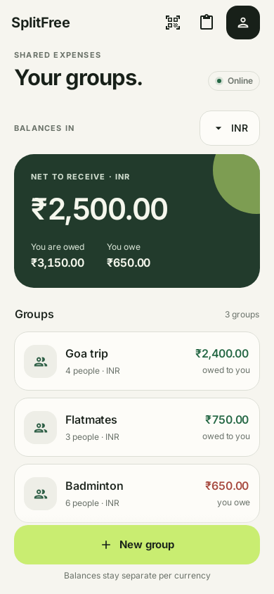
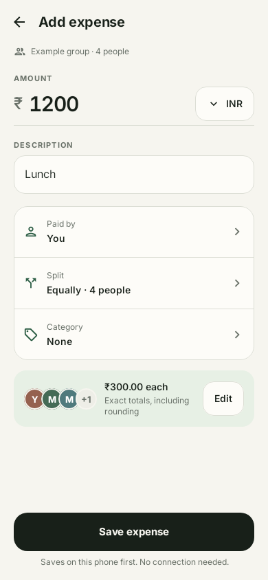
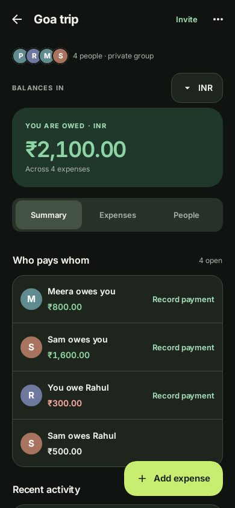
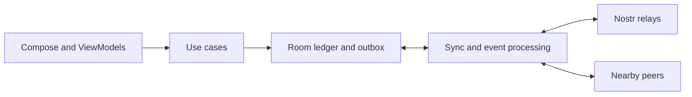

<p align="center">
  
</p>

<h1 align="center">SplitFree</h1>

<p align="center">
  <b>Decentralized expense splitting for Android.</b><br/>
  No signup. No subscription. No developer-operated backend.
</p>

<p align="center">
  Android 8.0+ · Kotlin · Jetpack Compose · Nostr · <a href="LICENSE">GPL-3.0-or-later</a>
</p>

<p align="center">
  <a href="#why-splitfree">Why SplitFree?</a> ·
  <a href="#features">Features</a> ·
  <a href="#how-it-works">How it works</a> ·
  <a href="#architecture">Architecture</a> ·
  <a href="#getting-started">Getting started</a> ·
  <a href="#testing">Testing</a> ·
  <a href="#contributing">Contributing</a>
</p>

SplitFree is an open-source Android app for sharing expenses with friends, flatmates, and travel companions.

- **Track shared costs:** record who paid, split expenses, and see who owes whom.
- **Work offline:** keep your ledger and calculate balances on your phone.
- **Sync privately:** exchange encrypted updates through [Nostr](https://nostr.com) relays or nearby group members.

<p align="center">
  
  
  
</p>

## Why SplitFree?

Shared expenses should be simple to track, without a subscription or a new account.

| Principle | What it means in SplitFree |
| --- | --- |
| **No signup** | A locally generated cryptographic keypair identifies you. No email or phone number is required. |
| **Local-first** | Add expenses and calculate balances on your device; synchronization happens separately. |
| **No proprietary backend** | Use third-party Nostr relays and direct Nearby connections rather than a SplitFree cloud service. |
| **Private payloads** | Expense content is end-to-end encrypted. Routing metadata remains visible to relays. |
| **Portable data** | Back up your identity and export group data instead of depending on account recovery from a provider. |
| **Open source** | Inspect, build, and modify the app under GPL-3.0-or-later. No subscription or advertising SDKs. |

Nostr relays are third-party servers; Nearby and QR scanning use Google Play services.
See [Privacy](#privacy) for what those dependencies can see.

## Features

### Expense management

- **Flexible splitting:** divide an expense equally, by exact amounts, by percentages, or by shares.
- **Multi-currency ledgers:** keep balances separate for each supported currency, with amounts stored
  in integer minor units. SplitFree does not convert currencies or combine unlike totals.
- **Corrections and settlements:** edit or delete your own expenses and record payments between members.
  Corrections are new ledger events rather than edits to signed history.
- **Debt simplification:** suggest a small set of payments that settles the group's balances.
  The app records payments; it does not transfer money or connect to a bank.
- **Balance snapshots:** creator-signed snapshots reduce repeated calculation while recording the
  events they cover.

### Privacy and identity

- **End-to-end payload encryption:** [NIP-44](https://nips.nostr.com/44) v2 protects expense,
  settlement, and group-metadata content before it leaves the device.
- **Optional gift wrapping:** [NIP-59](https://nips.nostr.com/59), enabled by default, hides the
  author of wrapped expenses and settlements from relays. It does not hide all routing metadata.
- **Recoverable identity:** export your private key as a 24-word BIP-39 recovery phrase.
- **Member removal and identity replacement:** the group creator can remove a member and rotate
  the group key; a member can revoke and replace their own identity. Neither erases history
  already obtained by someone holding an older key.

### Sync and connectivity

- **Relay synchronization:** send and receive encrypted events over Nostr WebSockets, with a durable
  outbox and persisted history cursors for recovery after interruptions.
- **Nearby synchronization:** exchange updates without internet using Google Nearby Connections,
  which selects Bluetooth, Bluetooth Low Energy, or Wi-Fi for the connection.
- **Carry-forward delivery:** members can hold sealed updates addressed to other members and pass
  them on during a later Nearby session, subject to the protocol's storage and forwarding limits.
- **Private invitations:** share a compact, versioned link or QR code containing the group details
  and current group key. Groups support up to 50 members.
- **Battery-aware scheduling:** background relay sync and Nearby discovery duty cycles adapt to
  battery state. Android still controls when background work can run.

### Everyday use

- **Material 3 interface:** system, light, and dark themes with a consistent brand palette.
- **Backup and restore:** export a group or all groups as `.splitfree` files and restore them with
  the identity that created the backup.
- **QR and link joining:** scan, open, or paste an invite instead of exchanging account details.
- **Developer diagnostics:** debug builds include an in-app protocol log; release builds do not
  expose that debug screen.

## How it works

### 1. Create an identity and a group

| Component | How it works |
| --- | --- |
| **Identity** | A secp256k1 keypair is generated locally. Your public key identifies you; your private key signs events. |
| **Recovery phrase** | A 24-word BIP-39 phrase encodes your private key. Keep it secret. |
| **Group key** | Each group gets a random 256-bit shared key. `GroupEncryption` derives its NIP-44 conversation key. |
| **Key epoch** | The group-key version. Rotation advances the epoch and delivers the new key individually to remaining members, not under the old shared key. |

### 2. Invite members privately

Share a QR code or a compact link: `splitfree://join?d=...`.

| Included in the link | Purpose |
| --- | --- |
| Group ID, creator's public key, creation time | Identify the group; the decoder checks that its ID matches the creator and creation time. |
| Group key and epoch | Let the recipient decrypt data under the included key version. |
| Relay list, expiry, group name | Locate the group's relays, check link expiry, and display the group name. |

> **Treat invitations as secrets:** the link itself grants access to the included group key.

- Share invites in person or through a trusted private channel.
- Use a fresh link after membership or relay changes.
- Expiry does not erase a disclosed key; previously copied links are not automatically revoked.

### 3. Record expenses and compute balances

- **Event format:** expenses and settlements use Nostr kind `30078` with encrypted JSON payloads.
- **Direct events:** signed by the original author.
- **Gift-wrapped events:** authenticated through a signed seal; the inner event has no standalone signature.
- **Expense identity:** group, original author, and UUID. Reusing a UUID cannot overwrite another member's expense.
- **Balances:** computed from applied events, with snapshots reducing replay work.

**Debt simplification**

- Matches the largest creditor and debtor until balances settle.
- Keeps each currency separate.
- Produces at most **n − 1 transfers** among *n* members with non-zero balances.
- Uses a greedy algorithm; the result is not guaranteed to use the mathematically fewest transfers.

### 4. Sync through relays

| Situation | Behavior |
| --- | --- |
| **App visible** | `LiveSync` catches up history and streams new events. |
| **App in background** | WorkManager handles queued delivery, periodic catch-up, and daily full sync. No persistent syncing notification. |
| **Relay unavailable** | Its persisted history cursor remains incomplete, even when a fallback relay responds. |
| **Connection restored** | Recovery retries on reconnection and bounded foreground timers, then uses scheduled work. |

**Delivery boundaries**

- Android may defer background jobs; public relays may be unavailable or discard history.
- Group relays are configurable, but built-in fallback relays are also included.
- Events publish through the connected relay pool, not exclusively through one group's selected relays.
- A successful publish means at least one relay accepted the event, not that every member received or applied it.
- **Sync is not a backup.** Keep identity and group-data backups separately.

### 5. Sync with nearby members

| Stage | Behavior |
| --- | --- |
| **Connect** | Both phones open Nearby sync and remain in the foreground. |
| **Authenticate** | Each phone proves key ownership with a Schnorr challenge; channel binding uses the SDK connection token when supplied. |
| **Authorize** | Membership checks permit the session to open one group. |
| **Reconcile** | Bounded frames, paged inventories, and receipts track the records exchanged. |
| **Resume** | Durable progress survives interruption; reconnecting authenticates again and resumes reconciliation. |

**Forwarding boundaries**

- Sealed envelopes can be carried to their intended recipients.
- Newly received records can be offered to other connected peers.
- An unsigned inner event alone is not independently verifiable forwarding evidence.
- Both phones must speak Nearby protocol **v3**.
- Forwarding is foreground-only and bounded by storage and retention limits.

See the [Nearby protocol guide](app/src/main/java/com/splitfree/sync/nearby/README.md) for the wire format, recovery rules, and limits.

## Architecture

SplitFree uses a **single Android app module**, organized into UI, domain, data, and sync packages.

- Repository contracts separate storage access from business operations.
- Focused use cases handle expense, group, and recovery actions.
- Relay and Nearby traffic share one event-processing pipeline.
- Boundaries are package-level, not separately enforced Android-free modules.



| Layer | Responsibilities | Main components |
| --- | --- | --- |
| **UI** | Screens, navigation, observable state, and reusable controls | Compose, ViewModels, `StateFlow`, Material 3 |
| **Domain** | Expense rules, balances, group operations, identity, and crypto | Use cases, models, repository contracts, `GroupEncryption`, `EventSigner` |
| **Data** | Persistence, secure key storage, repositories, and transports | Room, Android Keystore-backed storage, `NostrClient`, `NearbySync` |
| **Sync** | Validate and apply events, track delivery, recover history, and reconcile peers | `EventProcessor`, `EventPublisher`, `SyncEngine`, `LiveSync`, `PeerSession` |

### Protocols and cryptography

- **Implemented here:** Nostr protocol handling, NIP-44/NIP-59 support, and BIP-39 encoding.
- **Library primitives:** secp256k1-kmp and Bouncy Castle provide the underlying cryptography.

| Specification | Role | Implementation |
| --- | --- | --- |
| [NIP-01](https://nips.nostr.com/1) | Event model, signatures, subscriptions, relay messages | `NostrEvent`, `Relay`, `ClientMessage`, `RelayMessage` |
| [NIP-44](https://nips.nostr.com/44) | Version 2 encrypted payloads | `Nip44`: ChaCha20, HKDF, HMAC-SHA256, and padding |
| [NIP-59](https://nips.nostr.com/59) | Recipient-specific gift wrapping | `Nip59`: unsigned inner event → signed seal → outer gift wrap |
| [NIP-78](https://nips.nostr.com/78) | Application-specific data | Kind `30078` for ledger and group events |
| [BIP-39](https://en.bitcoin.it/wiki/BIP_0039) | 24-word identity backup and recovery | `Bip39`: private-key entropy encoded with the English wordlist and checksum |
| [BIP-340](https://bips.dev/340) | Schnorr signing and verification | `EventSigner`, `NostrEvent`, and secp256k1-kmp |

### Tech stack

| Area | Technology |
| --- | --- |
| Language | Kotlin 2.4.20 |
| Interface | Jetpack Compose, Material 3, Navigation Compose |
| Dependency injection | Hilt |
| Database | Room / SQLite |
| Networking | OkHttp WebSockets |
| Nearby transport | Google Nearby Connections |
| Cryptography | secp256k1-kmp, Bouncy Castle |
| Serialization / compression | kotlinx.serialization, LZ4 |
| Background work | WorkManager |
| QR generation / scanning | ZXing / Google ML Kit Code Scanner |
| Build | Gradle 9.7.1, Android Gradle Plugin 9.4.0, version catalog |
| Formatting / tests | Spotless + ktlint; JUnit 4, MockK, Robolectric, Compose UI tests |

Dependency versions are maintained in [`gradle/libs.versions.toml`](gradle/libs.versions.toml).

### Further reading

| Guide | Focus |
| --- | --- |
| [Nostr and relay sync](app/src/main/java/com/splitfree/data/nostr/README.md) | Event formats, encryption, relay acknowledgments, and history recovery. |
| [Nearby protocol](app/src/main/java/com/splitfree/sync/nearby/README.md) | Authentication, reconciliation, forwarding, and completion limits. |
| [Contributing](CONTRIBUTING.md) | Development workflow, test commands, and code organization. |
| [Releasing](RELEASING.md) | Signing, APK verification, source/notices, and device acceptance. |

## Getting started

### Use the app

- **Android:** 8.0 (API 26) or newer.
- **Google Play services:** required for Nearby sync and QR scanning.
- **Installation:** build from source below; see the [release guide](RELEASING.md) for a signed APK build.

| Step | Action |
| --- | --- |
| **1. Set up** | Create an identity and back up its recovery phrase. |
| **2. Join a group** | Create your own group or use a privately shared invite. |
| **3. Add expenses** | Enter the amount, choose who paid, and select the split. |
| **4. Settle up** | Review balances and record payments. |
| **5. Sync nearby** | Open Nearby sync on both phones to exchange updates without internet. |

Keep both your recovery phrase and `.splitfree` exports. See [Backups and recovery](#backups-and-recovery).

### Build from source

| Requirement | Version / setup |
| --- | --- |
| JDK | **17**; set `JAVA_HOME` accordingly |
| Android SDK | Platform **37** for compilation; API **26+** device or emulator |
| Gradle | Included wrapper; no separate Gradle installation needed |
| Android Studio | Optional; use a version compatible with the pinned Android Gradle Plugin |

```bash
git clone https://github.com/invincible04/SplitFree.git
cd SplitFree
./gradlew :app:assembleDebug
```

- **SDK path:** set `ANDROID_HOME` or configure `sdk.dir` in untracked `local.properties`.
- **Android Studio:** open the repository root, let Gradle sync, then select a device.
- **Windows:** use `gradlew.bat` instead of `./gradlew`.
- **Debug signing:** no release keystore or signing passwords needed.

| Command | Result |
| --- | --- |
| `./gradlew :app:assembleDebug` | Debug APK at `app/build/outputs/apk/debug/app-debug.apk` |
| `./gradlew :app:assembleRelease` | Signed, minified APK at `app/build/outputs/apk/release/app-release.apk`; requires signing setup |
| `./gradlew spotlessCheck` | Check Kotlin and Gradle formatting without modifying files |
| `./gradlew spotlessApply` | Apply formatting locally |
| `./gradlew :app:lintDebug :app:lintRelease` | Analyze both variants with Android Lint |

> **Installation safety:** debug is `com.splitfree.debug` (**SplitFree Debug**); production remains `com.splitfree` (**SplitFree**).

- Debug and production can coexist with separate private data. Debug does not claim external production invite links; use its in-app Scan or Paste.
- Older debug builds used the production ID. The new suffix does not migrate their data or make them replaceable by a differently signed release. Do not uninstall or clear them without verified backups.
- Share only the exact signed APK produced by the [verified local distribution command](RELEASING.md#verified-local-distribution). A raw Gradle build is not installation acceptance.

### Release signing

Place `splitfree-release.jks` at the repository root and add these values to `local.properties`,
preserving any `sdk.dir` entry:

| Property | Value |
| --- | --- |
| `RELEASE_STORE_PASSWORD` | Keystore password |
| `RELEASE_KEY_ALIAS` | Release-key alias |
| `RELEASE_KEY_PASSWORD` | Key password |

- **Keep credentials private:** both files are Git-ignored; back them up securely.
- **Preserve update compatibility:** retain the signing identity and increase `versionCode` for updates.
- **Configure the file:** the build reads these properties from `local.properties`, not environment variables.
- **Verify the release:** follow [RELEASING.md](RELEASING.md) for signatures, checksums, source, notices, and device acceptance.

**CI scope:** formatting, JVM tests, release-helper tests, both lints, and debug/unsigned release builds.

**Release automation:** version tags can prepare a signed APK in a draft GitHub Release after signing-secret setup and license approval. Nothing is published automatically; follow the [release checklist and GitHub setup](RELEASING.md#automated-apk-releases).

## Project structure

```text
app/src/main/java/com/splitfree/
├── data/
│   ├── ble/              # Google Nearby Connections transport
│   ├── identity/         # Identity/keypair management
│   ├── local/            # Room database, DAOs, entities
│   ├── nostr/            # Relay client, protocol, health and connection management
│   ├── repository/       # Repository implementations
│   ├── settings/         # Device preferences
│   └── util/             # Compression and encrypted storage
├── di/                   # Hilt dependency bindings
├── domain/
│   ├── crypto/           # Events, signatures, group encryption, NIP and BIP support
│   ├── invite/           # Versioned invite encoding and validation
│   ├── model/            # Groups, expenses, balances, exports, and sync models
│   ├── money/            # Currency catalog, amount parsing, and split calculations
│   ├── repository/       # Storage, identity, and publishing contracts
│   ├── usecase/          # Expense, group, backup, and recovery operations
│   ├── util/             # Shared helpers and relay defaults
│   └── validation/       # Event and payload checks
├── sync/
│   ├── event/            # Event processing, publication, and membership history
│   ├── nearby/           # Authentication, peer sessions, reconciliation, forwarding
│   └── worker/           # Live relay sync, WorkManager jobs, power-aware scheduling
├── ui/
│   ├── components/       # Shared Compose controls
│   ├── navigation/       # Routes and navigation graph
│   ├── screens/          # Onboarding, groups, expenses, Nearby, settings, diagnostics
│   ├── theme/            # Color, typography, spacing, and motion
│   ├── util/             # UI helpers and QR generation
│   └── viewmodels/       # Screen state and user actions
├── util/                 # Formatting, logging, and process-health diagnostics
├── MainActivity.kt       # Activity lifecycle and incoming links
└── SplitFreeApp.kt       # Application initialization and background-work setup
```

| Supporting files | Location |
| --- | --- |
| Test suites | [`app/src/test/`](app/src/test/) |
| Versioned Room schemas | [`app/schemas/`](app/schemas/) |
| Nearby state machine and wire format | [Protocol guide](app/src/main/java/com/splitfree/sync/nearby/README.md) |

## Testing

Run the standard local checks before submitting a change:

```bash
./gradlew spotlessCheck :app:testDebugUnitTest :app:lintDebug :app:assembleDebug
```

For a single class or coverage report:

```bash
./gradlew :app:testDebugUnitTest --tests 'com.splitfree.domain.crypto.nip.Nip44Test'
./gradlew :app:testDebugUnitTest :app:createDebugUnitTestCoverageReport
```

| Area | Coverage |
| --- | --- |
| **Cryptography** | Event signing/verification, NIP-44 test vectors, gift-wrap round trips, mnemonic encoding and recovery |
| **Ledger rules** | Split rounding, per-currency balances, corrections/deletions, settlements, snapshot coverage |
| **Groups and backups** | Invitations, membership, key rotation/revocation, authenticated export/import, epoch-key recovery |
| **Storage** | Room migrations, transaction boundaries, durable outbox, control-operation journals, deferred events |
| **Relay sync** | Message parsing, WebSocket lifecycle, per-relay catch-up, retries, and worker scheduling |
| **Nearby** | Channel-bound authentication, framing, reconciliation, interrupted sessions, and simulated multi-peer forwarding |
| **UI** | ViewModel state, Compose interactions, large-text/layout cases, and native-graphics fixture renders |

### Live-relay integration tests

Tests named `*IntegrationTest*` are excluded by default. Opt in explicitly:

```bash
./gradlew :app:testDebugUnitTest -DREAL_RELAY_TEST=true --tests '*IntegrationTest*'
```

- **Real network activity:** these tests contact relays and can publish events.
- **Safe fixtures:** use disposable identities and sample data.
- **JVM limits:** Robolectric and in-memory transports do not certify radios, Keystore durability, OS process death, or background timing.
- **Release acceptance:** test the signed, minified APK using the [device checklist](RELEASING.md#4-test-the-exact-signed-apk).

## Backups and recovery

A recovery phrase restores your identity, not your group keys or expense history. Keep both:

| Backup | Purpose | Keep in mind |
| --- | --- | --- |
| **24-word recovery phrase** | Restore the original private key and identity | Anyone with it can act as you. It does not contain the group ledger. |
| **`.splitfree` export** | Restore group data and included epoch keys | Requires the same identity that made it; metadata in the file is readable. |

**Backup format v2**

- Preserves encrypted expense payloads.
- Encrypts group keys to the exporting identity.
- Authenticates canonical exported data and metadata with HMAC-SHA256 and an identity-derived key.

**Recovery checklist**

- Store your phrase separately from exports.
- Refresh exports after important changes.
- Restore using the same identity that created the export.
- Do not rely on Android system backup; it is disabled for app data.
- Neither SplitFree nor relays can reconstruct lost keys for you.

## Security

| Protection | Scope |
| --- | --- |
| **Event validation** | Checks signatures, group scope, author permissions, and payload bounds before applying updates. |
| **Nearby authentication** | Binds proof of identity to the SDK connection token when supplied; a missing token does not provide channel binding. |
| **Key storage** | Encrypts private and group keys with AES-256-GCM under an Android Keystore key. Hardware backing depends on the device. |
| **Release hardening** | Enables R8 shrinking and obfuscation; these do not replace cryptographic checks. |

- Previously shared keys and history cannot be taken back.
- Historical membership has limits when a former member retains an old key; see [known limits](app/src/main/java/com/splitfree/sync/nearby/README.md#known-limits).

> **Report vulnerabilities privately:** follow [SECURITY.md](SECURITY.md) and use [GitHub private reporting](https://github.com/invincible04/SplitFree/security/advisories/new).

Never post private keys, recovery phrases, usable invitations, or backup files in public issues.

## Privacy

- No developer-operated backend or relay.
- No added analytics, tracking, advertising, or remote crash-reporting SDKs.
- Encryption protects payloads; the app is not anonymous and its entire database is not encrypted.

**What remains visible**

| Observer / storage | What remains visible |
| --- | --- |
| **Nostr relays** | Ciphertext, public event fields and tags, connection IP addresses, and activity timing. Gift wraps still expose recipient and group tags. |
| **Local app storage** | Group names, member lists, relay lists, and event metadata. Expense payloads remain encrypted; Android's sandbox protects access to app files. |
| **Google Play services** | Nearby and scanner modules have their own diagnostics and module downloads, governed by Google's policies and device settings. |

Read [PRIVACY.md](PRIVACY.md) for storage, permissions, and third-party-services details.

## Contributing

Contributions are welcome. Start with [CONTRIBUTING.md](CONTRIBUTING.md) and the [Code of Conduct](CODE_OF_CONDUCT.md).

| Contribution | Useful starting point |
| --- | --- |
| **Device testing** | Relay recovery, Nearby transfers, permissions, and backup restoration. |
| **Accessibility** | TalkBack, large text, focus behavior, and keyboard navigation. |
| **Localization** | Translations and locale-sensitive formatting. |
| **Regression coverage** | Focused tests for a reproducible bug or edge case. |

- Discuss larger features and protocol changes in an issue before implementing them.
- Include reproducible steps in bug reports.
- Redact identifiers and sensitive data from logs before sharing.

## License

Copyright © 2026 SplitFree Contributors.

- **Project:** [GNU General Public License, version 3 or later](LICENSE) (`GPL-3.0-or-later`), without warranty.
- **Binary redistribution:** include corresponding source and required notices; see the [release guide](RELEASING.md).
- **Dependencies:** retain their own licenses.
- **Inter typeface:** by The Inter Project Authors, licensed under the [SIL Open Font License 1.1](app/src/main/assets/licenses/Inter-OFL.txt).
