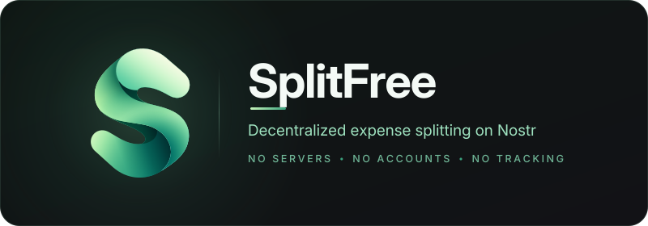

<p align="center">
  
</p>

<h1 align="center">SplitFree</h1>

<p align="center">
  <b>Decentralized expense splitting: no servers, no accounts, no tracking.</b>
</p>

<p align="center">
  <a href="https://github.com/invincible04/SplitFree/actions"></a>
  
  
  <a href="LICENSE"></a>
</p>

<p align="center">
  <a href="#why-splitfree">Why SplitFree?</a> •
  <a href="#features">Features</a> •
  <a href="#how-it-works">How It Works</a> •
  <a href="#architecture">Architecture</a> •
  <a href="#getting-started">Getting Started</a> •
  <a href="#testing">Testing</a> •
  <a href="#contributing">Contributing</a>
</p>

---

## Why SplitFree?

Every expense-splitting app today wants your money or your data, or both. Monthly subscriptions for basic features, mandatory accounts that harvest your financial data, and proprietary servers that can shut down anytime. I built SplitFree because I was fed up with all of it.

| | Traditional Apps | SplitFree |
|---|---|---|
| **Cost** | Free tier + paywalled features | 100% free, forever |
| **Data storage** | Company servers | Your device only |
| **Account** | Email/phone required | Cryptographic keypair (no signup) |
| **Sync** | Proprietary cloud | Nostr relays + Bluetooth |
| **Encryption** | Server-side (they can read it) | End-to-end (relays see only ciphertext) |
| **Identity** | Email/password | 24-word mnemonic backup (BIP-39) |
| **Offline** | ❌ Requires internet | ✅ BLE sync with nearby members |

SplitFree is built entirely on the [Nostr](https://nostr.com) protocol, an open, decentralized network. Your groups sync peer-to-peer through public Nostr relays and local Bluetooth, so your financial data stays under your control.

## Features

### 🔐 Privacy & Security
- **End-to-end encryption**: all group data encrypted with [NIP-44](https://nips.nostr.com/44) v2 (ChaCha20 + HMAC-SHA256); relays see only ciphertext
- **Gift Wrap privacy**: optional [NIP-59](https://nips.nostr.com/59) triple-layer encryption hides sender metadata from relays
- **Cryptographic identity**: [BIP-340](https://bips.dev/340) Schnorr keypair as your identity, exportable as a [BIP-39](https://en.bitcoin.it/wiki/BIP_0039) 24-word mnemonic
- **Key revocation & group migration**: rotate your identity or remove members without losing history

### 💰 Expense Management
- **Flexible splits**: equal, exact amount, percentage, or share-based splitting
- **Multi-currency support**: track expenses in any currency, balances computed per currency
- **Smart debt simplification**: greedy algorithm reduces settlement to at most n−1 transfers (not guaranteed minimal; that problem is NP-hard)
- **Balance snapshots**: periodic snapshots reduce recomputation for large groups

### 🔄 Sync & Connectivity
- **Decentralized sync**: expenses propagate through Nostr relays ([NIP-01](https://nips.nostr.com/1)) with no proprietary backend
- **Offline-first BLE sync**: sync with nearby group members over Bluetooth Low Energy when there's no internet
- **Adaptive power management**: sync intervals, relay connections, and BLE duty cycles adjust to battery state
- **Invite links**: one compact, versioned bearer link carries everything a joiner needs (group id, creator, key epoch, group key, relays, expiry, name); the group id is bound to its creator so a forged "created by" cannot pass

### 🎨 User Experience
- **Material 3 + circular reveal theme switching**: light/dark theme with smooth animation
- **Export / Import**: self-contained encrypted backup (`.splitfree` files, format v2) for cross-device transfer; the whole file is authenticated with HMAC-SHA256 under a key HKDF-derived from your identity, so only the identity that made a backup can restore it
- **QR code sharing**: scan to join groups instantly
- **Debug log**: real-time protocol event viewer for developers

## How It Works

```
┌──────────┐   splitfree://join?d=...   ┌──────────┐
│  Alice   │ ◄────────────────────────  │   Bob    │
│ (keypair)│                            │ (keypair)│
└────┬─────┘                            └────┬─────┘
     │                                       │
     │  ┌─────────────────────────────────┐  │
     ├──►  Nostr Relay (sees ciphertext)  ◄──┤  ← NIP-44 encrypted events
     │  └─────────────────────────────────┘  │
     │                                       │
     │  ┌─────────────────────────────────┐  │
     └──►     Bluetooth Low Energy        ◄──┘  ← Direct sync (no internet)
        └─────────────────────────────────┘
```

1. **Identity**: On first launch, a secp256k1 keypair is generated. The public key is your identity. Back it up as a 24-word BIP-39 mnemonic.

2. **Groups**: Creating a group generates a random 256-bit symmetric key. All group events are encrypted with this key using NIP-44 v2 before publishing to relays.

3. **Invites**: Share a compact deep link (`splitfree://join?d=...`). It is a single versioned binary payload containing the group id, the creator's pubkey, the creation time, the key epoch, the group key itself, the relay list, an expiry, and the group name. The group id is derived from `(creator pubkey, createdAt)`, so a joiner can verify the creator claim before trusting it. The link is a bearer credential (anyone holding it can join and read the group), so share it over a channel you trust (in person via QR, or an end-to-end encrypted messenger).

4. **Expenses**: Expenses are signed Nostr events (kind 30078) with encrypted JSON content. Each expense records who paid, who owes, the split method, and the amount.

5. **Sync**: The app connects to multiple Nostr relays via WebSocket, subscribes to group events, and processes them through validation → decryption → storage → post-processing. A foreground service maintains real-time sync; WorkManager handles periodic and midnight sync.

6. **BLE Sync**: When two group members are nearby, they can sync directly over Bluetooth using Google Nearby Connections. The BLE protocol uses binary framing with fragmentation, LZ4 compression, and a Schnorr challenge-response handshake for authentication.

7. **Balances**: Balances are computed from the full event history (with snapshot optimization). The debt simplification algorithm greedily matches the largest creditor with the largest debtor, which settles everyone in at most n−1 transfers; it does not search for the true minimum.

## Architecture

The codebase follows **Clean Architecture** with strict layer separation. The domain layer is pure Kotlin with zero Android dependencies.

```
┌─────────────────────────────────────────────────────────────┐
│                        UI Layer                             │
│   Jetpack Compose  •  Material 3  •  Navigation Compose     │
│   Screens: Onboarding, Groups, GroupDetail, AddExpense,     │
│            Settings, NearbySync, DebugLog                   │
├─────────────────────────────────────────────────────────────┤
│                    ViewModel Layer                          │
│   Hilt-injected ViewModels  •  StateFlow  •  UiState        │
├─────────────────────────────────────────────────────────────┤
│                Domain Layer (pure Kotlin)                   │
│   Use Cases: CreateGroup, JoinGroup, AddExpense,            │
│     ComputeBalances, SimplifyDebts, CreateSnapshot,         │
│     RevokeKey, MigrateGroup, Export/Import, SelfHeal        │
│   Crypto: NostrEvent, GroupEncryption,                      │
│           EventSigner, Bip39                                │
│   Validation: EventValidator (timestamps, rate limits,      │
│              content safety, author checks)                 │
├─────────────────────────────────────────────────────────────┤
│                     Data Layer                              │
│   Room DB (events, groups, outbox)                          │
│   Nostr: Relay (OkHttp WebSocket), NostrClient,             │
│          RelayHealthMonitor, RelayConnectionManager         │
│   BLE: NearbySync, BleTransfer, BleProtocol (binary framing)│
│   Sync: SyncEngine, SyncWorker, ForegroundSyncService,      │
│         MidnightSyncWorker, SyncScheduler, PowerManager     │
│   Settings: Android Keystore (AES-256-GCM)                  │
└─────────────────────────────────────────────────────────────┘
```

### Nostr Protocol (implemented from scratch, no third-party Nostr libraries)

| NIP | Purpose | Implementation |
|-----|---------|----------------|
| [NIP-01](https://nips.nostr.com/1) | Event model, signing, relay protocol | `NostrEvent`, `Relay`, `ClientMessage`, `RelayMessage` |
| [NIP-44](https://nips.nostr.com/44) | Encrypted payloads (v2) | `Nip44`: ChaCha20 + HKDF + HMAC-SHA256 + padding |
| [NIP-59](https://nips.nostr.com/59) | Gift Wrap (triple-layer encryption) | `Nip59`: Rumor → Seal → Gift Wrap |
| [NIP-78](https://nips.nostr.com/78) | App-specific data (kind 30078) | Used for expense/settlement/group events |
| [BIP-39](https://en.bitcoin.it/wiki/BIP_0039) | Mnemonic seed phrases | `Bip39`: 24-word mnemonic generation & recovery |
| [BIP-340](https://bips.dev/340) | Schnorr signatures | `Secp256k1` via `fr.acinq.secp256k1` |

### Tech Stack

| Layer | Technology |
|-------|-----------|
| Language | Kotlin 2.4 |
| UI | Jetpack Compose + Material 3 |
| DI | Hilt (Dagger) |
| Database | Room (SQLite) |
| Networking | OkHttp (raw WebSocket) |
| Crypto | secp256k1-kmp, BouncyCastle |
| BLE | Google Nearby Connections API |
| Serialization | kotlinx.serialization |
| Compression | LZ4 |
| Background | WorkManager + Foreground Service |
| QR | ZXing + ML Kit Code Scanner |
| Build | Gradle 9.7 + AGP 9.4 (built-in Kotlin) + Version Catalog |
| Lint | Spotless + ktlint |
| Testing | JUnit 4, MockK, Robolectric |

## Getting Started

### Prerequisites

- Android Studio Meerkat (2024.3+) or later
- JDK 17
- Android SDK 37 (compile) / SDK 26+ (min)

### Clone & Run

```bash
git clone https://github.com/invincible04/SplitFree.git
cd SplitFree
```

1. Open in Android Studio → **File → Open** → select the project root
2. Let Gradle sync complete
3. Run on a device or emulator (API 26+)

### Building

```bash
./gradlew assembleDebug          # Debug build
./gradlew assembleRelease        # Release build (needs signing config)
./gradlew spotlessApply           # Format code
./gradlew lint                    # Lint check
```

### Release Signing

Place your keystore file as `splitfree-release.jks` in the project root, then create `local.properties`:

```properties
RELEASE_STORE_PASSWORD=<your-store-password>
RELEASE_KEY_ALIAS=<your-key-alias>
RELEASE_KEY_PASSWORD=<your-key-password>
```

## Project Structure

```
app/src/main/java/com/splitfree/
├── data/
│   ├── ble/              # BLE sync (NearbySync, BleTransfer, BleProtocol)
│   ├── identity/         # IdentityManager (keypair management)
│   ├── local/            # Room database, DAOs, entities
│   ├── nostr/            # NostrClient, Relay, RelayConfig, EventThrottler
│   │   ├── protocol/     # ClientMessage, RelayMessage, NostrFilter
│   │   └── relay/        # RelayConnectionManager, RelayHealthMonitor
│   ├── repository/       # GroupRepository, ExpenseRepository
│   ├── settings/         # UserPreferences (plain SharedPreferences)
│   └── util/             # Compression, Keystore-backed encrypted storage
├── di/                   # Hilt modules (Database, Repository)
├── domain/
│   ├── crypto/           # NostrEvent, GroupEncryption, IdentityManager, EventSigner
│   │   └── nip/          # Nip44, Nip59, Bip39 (from-scratch implementations)
│   ├── invite/           # InviteLinkCodec (compact bearer invite link, creator-bound group id)
│   ├── model/            # Domain models (Group, Expense, Balance, Settlement)
│   ├── repository/       # Repository contracts (interfaces)
│   ├── usecase/          # Business logic use cases
│   │   ├── expense/      # AddExpense, ComputeBalances, SimplifyDebts, Snapshots
│   │   ├── export/       # Export/Import, whole-file HMAC keyed from the identity (HKDF)
│   │   ├── group/        # CreateGroup, JoinGroup, MigrateGroup, RevokeKey
│   │   └── sync/         # SelfHeal
│   ├── util/             # HexUtil, HashUtil, RelayDefaults, CompressionProvider
│   └── validation/       # EventValidator (timestamps, rate limits, content safety)
├── sync/
│   ├── event/            # EventProcessor, EventPublisher, EventPostProcessor, ExpenseNotifier
│   └── worker/           # SyncWorker, SyncEngine, ForegroundService, PowerManager
├── ui/
│   ├── navigation/       # NavGraph, Screen definitions
│   ├── screens/          # Compose screens (onboarding, groups, expenses, settings, etc.)
│   ├── theme/            # Material 3 theme, circular reveal animation
│   └── util/             # QR code generator
├── util/                 # DebugLog, CurrencyFormatter, ProcessHealthTracker
├── MainActivity.kt       # Deep link handling, intent sanitization
└── SplitFreeApp.kt       # Application class, WorkManager config, battery receiver
```

## Testing

Comprehensive unit tests across every layer of the app.

```bash
./gradlew test                                                    # Unit tests only
./gradlew testDebugUnitTest app:createDebugUnitTestCoverageReport # With coverage
./gradlew test --tests "com.splitfree.domain.crypto.nip.Nip44Test" # Specific class

# Integration tests (real Nostr relays; excluded by default)
./gradlew test -DREAL_RELAY_TEST=true                             # All tests including integration
./gradlew test -DREAL_RELAY_TEST=true --tests "*IntegrationTest"  # Integration tests only
```

| Area | What's Tested |
|------|--------------|
| Crypto | NIP-01 signing/verification, NIP-44 encrypt/decrypt with spec test vectors, NIP-59 gift wrap round-trips, BIP-39 mnemonic generation |
| Protocol | Relay message parsing, client message serialization, filter construction, WebSocket lifecycle |
| Use Cases | Balance computation, debt simplification, group creation/join/migration, key revocation, export/import, snapshots |
| Sync | SyncEngine pull/flush, power management modes, boot receiver, self-heal republishing |
| BLE | Binary protocol encode/decode, fragmentation/reassembly, handshake authentication, payload processing |
| Validation | Timestamp bounds, rate limiting, content safety (nesting depth, size), author authorization, tombstone checks |
| Integration | Full relay round-trips, end-to-end expense lifecycle, multi-phone simulation (`*IntegrationTest.kt`; excluded by default, run with `-DREAL_RELAY_TEST=true`) |

## Contributing

Contributions are welcome! See [CONTRIBUTING.md](CONTRIBUTING.md) for detailed guidelines.

```bash
# Quick start
git clone https://github.com/<your-username>/SplitFree.git
git checkout -b feat/your-feature-name
# Make changes, then:
./gradlew test && ./gradlew spotlessApply && ./gradlew lint
# Commit with Conventional Commits format, push, and open a PR
```

### Areas Where Help Is Needed

- 🌍 **Localization**: i18n support for multiple languages
- 🧪 **UI tests**: Compose UI test coverage
- 📱 **iOS port**: Kotlin Multiplatform or native Swift implementation
- 📖 **Documentation**: User guides, relay operator docs
- ♿ **Accessibility**: Screen reader support, content descriptions
- 🎨 **Design**: App icon, screenshots, Play Store assets

## Security

SplitFree takes security seriously:

- All group data is end-to-end encrypted (NIP-44 v2)
- Private keys stored in Android Keystore (AES-256-GCM, hardware-backed)
- Event signatures verified on receipt (BIP-340 Schnorr)
- Content validated for size limits, nesting depth, and rate limiting
- BLE connections authenticated via Schnorr challenge-response handshake
- ProGuard/R8 enabled for release builds

If you discover a security vulnerability, please **do not** open a public issue. Instead, [report it privately via GitHub](https://github.com/invincible04/SplitFree/security/advisories/new) and we'll address it promptly. See [SECURITY.md](SECURITY.md) for full details.

## Privacy

SplitFree collects no personal data. All expense data is end-to-end encrypted and stored only on your device. See [PRIVACY.md](PRIVACY.md) for the full privacy policy.

## License

This project is licensed under the [GNU General Public License v3.0](LICENSE).

```
Copyright (C) 2026 SplitFree Contributors

This program is free software: you can redistribute it and/or modify
it under the terms of the GNU General Public License as published by
the Free Software Foundation, either version 3 of the License, or
(at your option) any later version.
```

### Third-party licenses

- **Inter** typeface by The Inter Project Authors, licensed under the [SIL Open Font License 1.1](app/src/main/assets/licenses/Inter-OFL.txt). Bundled as `res/font/inter_variable.ttf`.

---

<p align="center">
  Built with ❤️ on <a href="https://nostr.com">Nostr</a>
</p>
